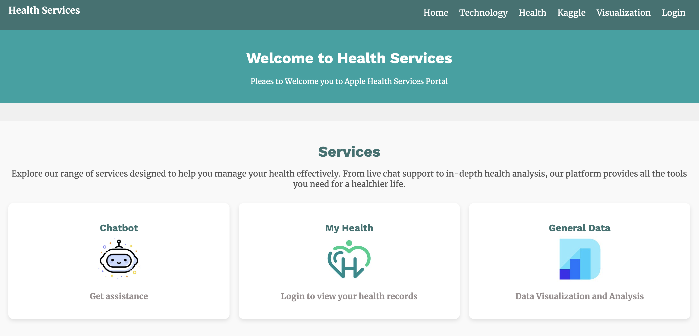
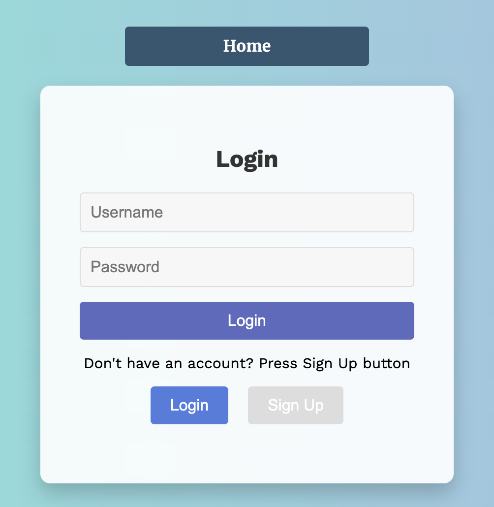
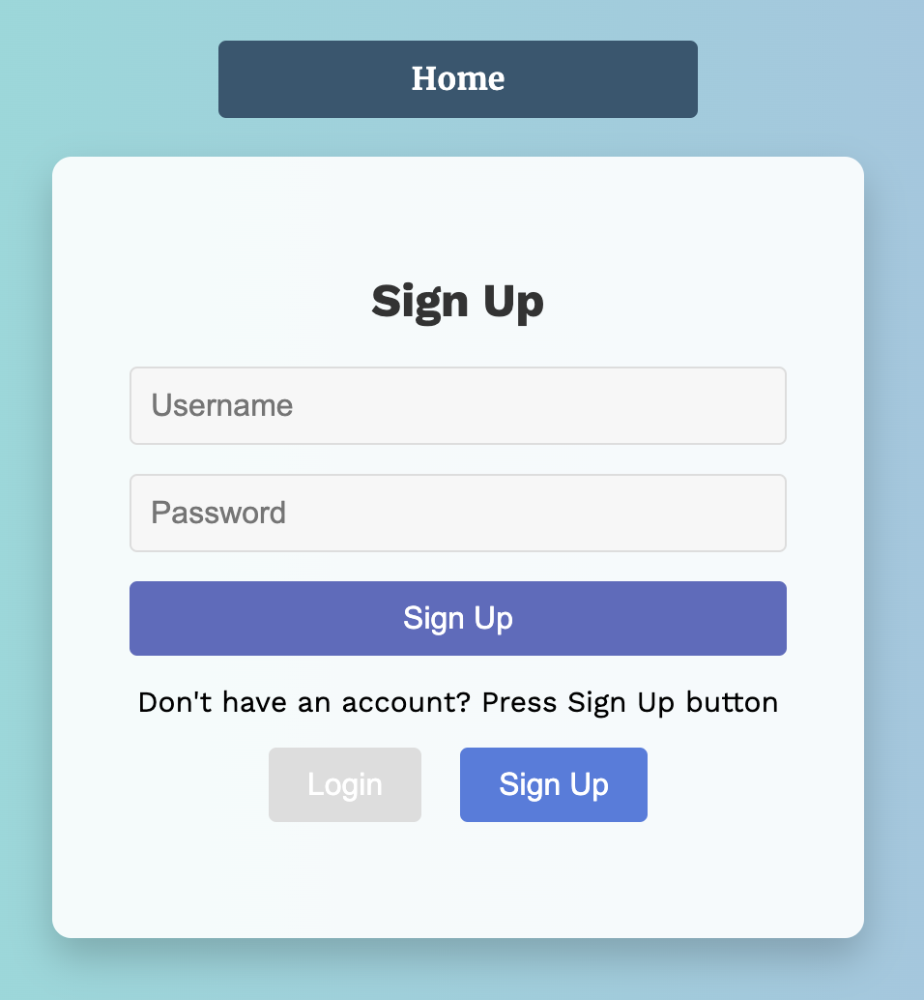
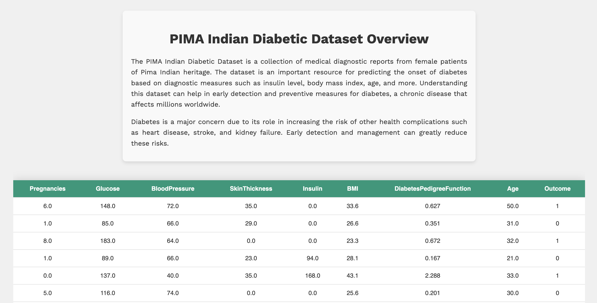
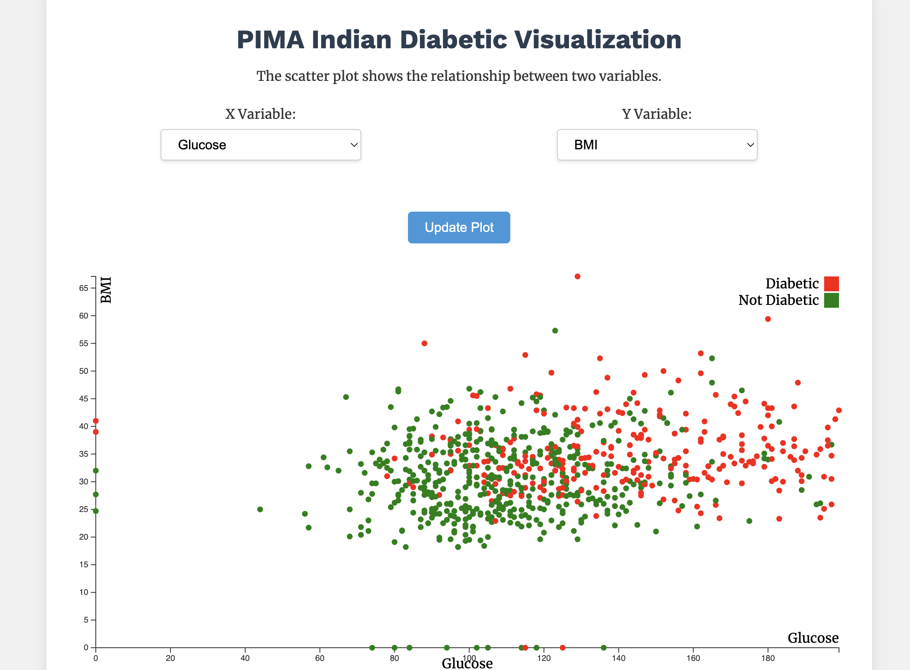
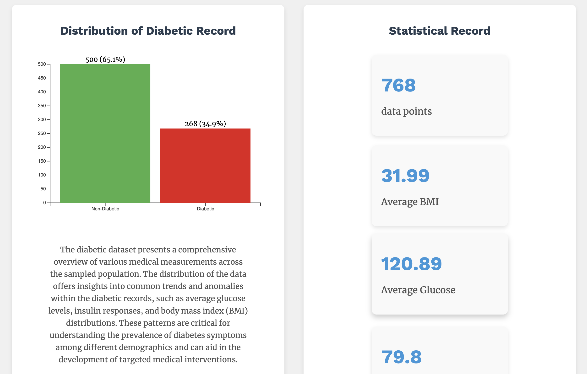
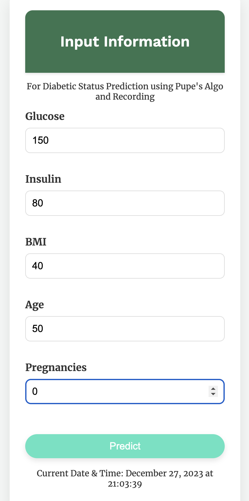
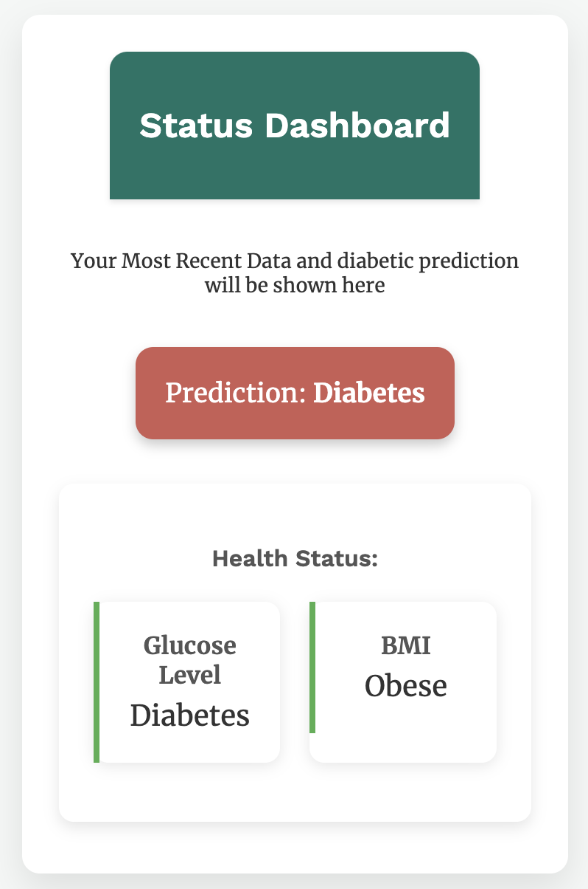
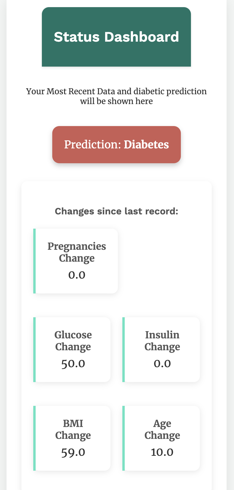
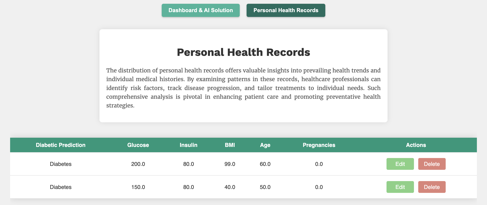

# Multi-platform: Diabetic Prediction 
The proposed software is called ‘Diabetic Prediction’. The diabetic prediction project aimed to create an accessible interface for users to predict diabetes risk. A ensemble machine learning model has been developed using a dataset sourced called Pima-Indian Diabetic from Kaggle. This project integrated a model that utilizes user-provided medical information to offer predictive insights. Additionally, the platform provides chatbot-based assistance with sentimental analysis and visualizations of diabetes-related statistics of the general population.

    

Remark: This project is part of the course DES323 Multi-platform Software Development (MSD) during the Semester 1 Year 2023

---

## Project Development
The following diagram shows the use case diagram of the application. Some features are reserved for authenticated users only.

    

In addition to essential functions like creating an account, logging in, and logging out, users can perform CRUD operations to input medical data for predictive analysis and maintain their records. The chatbot functionality is operational, aiding users in various interactions. Furthermore, users have the flexibility to view data in their preferred format, choosing between tabular or graphical representations.

Business Process Modeling Notation for the Diabetic Prediction Website

    

#### Business Process
1. *Create Account*: Each user must have an account with the platform prior to any action. If this is the user’s first time using the platform, they must create an account by providing necessary information to set up their profile.
2. *Log in*: Authenticated users access the platform by logging in using their registered credentials. Successful login grants access to the platform's functionalities.
3. *Browse Features*: Users can explore and navigate through the various features offered by the interface, including predictive diabetes assessment, chatbot assistance, and data visualization.
4. *Input Medical Information*: Users enter their relevant medical data, including parameters required for diabetes risk assessment. This information serves as input for the predictive model.
5. *Talk to Chatbot*: Users utilize the integrated chatbot to receive personalized assistance, seeking information, clarification, or guidance on diabetes-related queries. Additionally, they engage in extra interactions, such as sharing jokes, as a component of sentiment analysis.
6. *View General Data*: Users can view general statistics and visualizations derived from the dataset, providing insights into diabetes-related trends and information.
7. *Log out*: Users complete their session and log out, ensuring the security and privacy of their account information.

#### System Requirements
1. *Authentication*: The Authentication function ensures secure access, permitting only authorized users to interact with the health assistance interface.
2. *Input*: The Input function provides a user-friendly interface for users to input their medical information, allowing users to submit relevant data required for diabetes risk assessment.
3. *Calculation*: The Calculation function performs the core predictive analysis based on the user's input data. Utilizing the provided medical information, it processes the data through the predictive model, conducting calculations to generate personalized predictions regarding the user's risk of developing diabetes. 
4. *Displaying*: The Displaying function visualizes data and statistics related to diabetes, presenting insightful information about the general population. 
5. *User Interactions*: The chatbot assistance provides user interactions and facilitates seamless engagement between users and the interface. 
6. *Reporting*: The Reporting function captures and presents summarized information or outcomes from user interactions or system operations. It compiles essential data or insights, enabling users or administrators to generate reports, summaries, or analytics related to user activities, predictions, or system performance.
7. *Storing*: The Storing function manages the storage and retrieval of user data and system-generated information. It securely stores user profiles, inputted medical data and calculation results.

---

## Frontend Development: User Interface

In this section, discussion regarding Frontend and Backend development will be discussed. Django, a powerful web framework for Python, allowed seamless deployment of our predictive model to our platform. Apart from Django, integration of JSON and D3.js empowered the delivery of  comprehensive and user-friendly health assistance interface, equipped with predictive analytics and interactive data visualizations.

    <h3>Homepage and Login/Signup</h3>
    
    
Home page

        
    
Login
    
    
    
Signup

    <h3>Kaggle Dataset and Data Visualization with statistics</h3>
    
    
Pima Indian Diabetic Dataset from Kaggle

        
    
Data Visualization using D3.js
    
    
    
Statistics of the Dataset

    <h3>Diabetic Prediction and Personal Data (CRUD)</h3>
    
    
Input information to make prediction

    
    
Prediction Result

        
    
Preduction Result that shows the changes since last record
    
    
    
Personal Data in a Table with CRUD functionalities

    <h3>Chatbot</h3>
    
    
Sample Chatbot response: response is predetermined depending on the result of the sentimental analysis along with joke in the response (to showcase the ability to use external API

---

## Backend Development: API Endpoints & Functionalities
|API end-point|Purpose  |
|--|--|
| **api/predict_diabetes/** |  A custom API endpoint for the Diabetic prediction through the ensemble machine learning model. It processes input medical data, utilizing the model to predict the likelihood of diabetes based on the provided information|
|**distribution_count**| An endpoint that provides summary statistics and distribution of diabetic and non-diabetic instances in the Pima Indian diabetes Kaggle dataset|
|**scatter_plot_data/**|This endpoint fetches essential data from the Kaggle dataset, specifically curated for Scatter Plot visualization. It enables the extraction of data points necessary for generating comprehensive scatter plots representing various diabetes-related parameters|
|**ht_average_record:**|Incorporated into the homepage, this endpoint provides a summarized overview of personal statistics related to diabetes. It offers a quick snapshot of essential health indicators, aiding users in understanding their health status at a glance|
|**api/sentimental_analysis/**|This endpoint performs sentiment analysis tasks. It aids in analyzing and understanding user sentiments, providing valuable insights based on textual data input|
|**jokes/**|A Web API from RESTful functionalities, this endpoint retrieves random geek jokes from the Geek-Jokes API. It introduces a lighter element within the interface, providing users with entertaining snippets while engaging with the system|
|**api/register/**|Primarily designed to enable users to register new accounts within the system, this endpoint facilitates the creation of new user accounts|
|**api/login/**|This endpoint enables seamless login functionality for existing users to their accounts|
|**debug_delete**|This API endpoint serves a crucial role in the debugging process of our system. Specifically designed for debugging purposes, this endpoint enables the deletion of Kaggle dataset-related information within the system|

---

## Conclusion and Future work

The Diabetic Prediction housing the predictive model demonstrates functionality and can successfully pass through all the test cases. Its ability to process medical data, engage users via the chatbot, and present visualized data is a testament to its usability. While challenges arose during development, the resolution contributed to the interface's overall success. The significance of this working interface extends to its potential for practical use in real-world scenarios. Moreover, the adaptability of the model suggests future scalability, where additional datasets and increased data volumes could further enhance its predictive accuracy.

Future work could focus on exploring additional datasets and enhancing data acquisition could improve the model's accuracy and broaden its applicability. Furthermore, integrating additional functionalities or refining existing ones based on user feedback could elevate the interface's usability and effectiveness in aiding diabetes risk assessment.

---

## Thank you!
