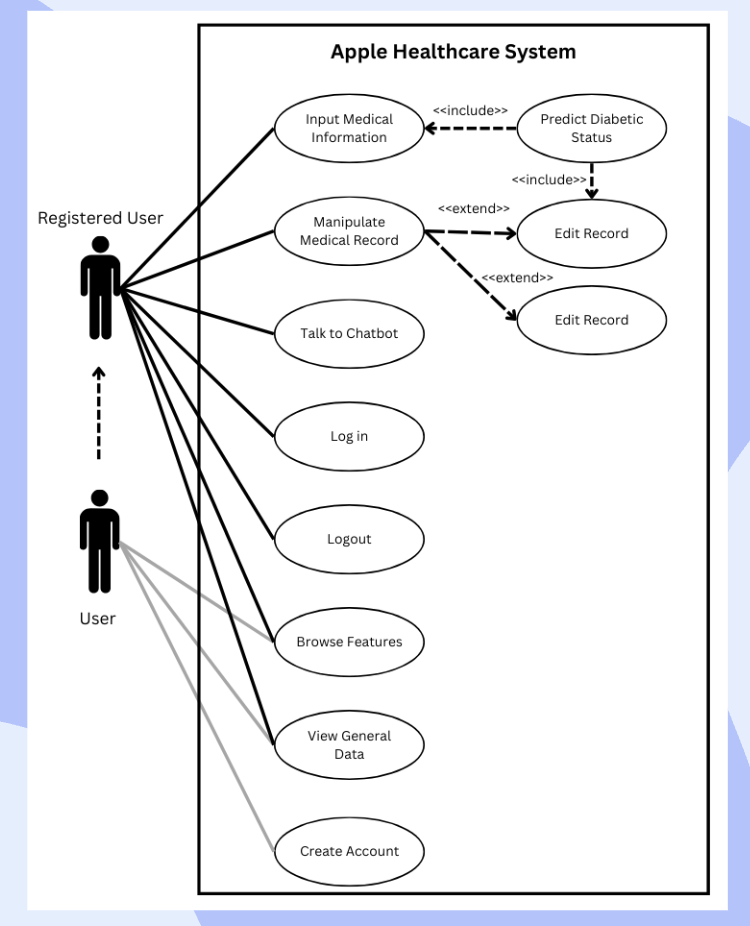
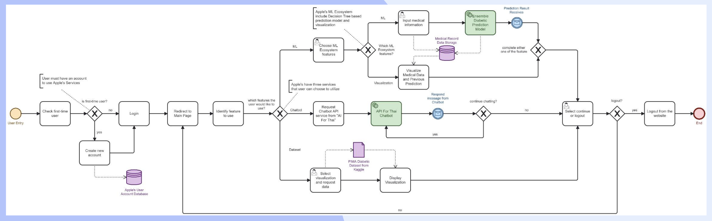

# Multi-platform: Diabetic Prediction 
The proposed software is called ‘Diabetic Prediction’. The diabetic prediction project aimed to create an accessible interface for users to predict diabetes risk. A ensemble machine learning model has been developed using a dataset sourced called Pima-Indian Diabetic from Kaggle. This project integrated a model that utilizes user-provided medical information to offer predictive insights. Additionally, the platform provides chatbot-based assistance with sentimental analysis and visualizations of diabetes-related statistics of the general population.

***Remark***: This project is part of the course:  DES323 Multi-platform Software Development (MSD) ~ Semester 1 Year 2023

## Project Development
The following diagram shows the use case diagram of the application. Some features are reserved for authenticated users only.

    

In addition to essential functions like creating an account, logging in, and logging out, users can perform CRUD operations to input medical data for predictive analysis and maintain their records. The chatbot functionality is operational, aiding users in various interactions. Furthermore, users have the flexibility to view data in their preferred format, choosing between tabular or graphical representations.

Business Process Modeling Notation for the Diabetic Prediction Website

    

#### Business Process
1. *Create Account*: Each user must have an account with the platform prior to any action. If this is the user’s first time using the platform, they must create an account by providing necessary information to set up their profile.
2. *Log in*: Authenticated users access the platform by logging in using their registered credentials. Successful login grants access to the platform's functionalities.
3. *Browse Features*: Users can explore and navigate through the various features offered by the interface, including predictive diabetes assessment, chatbot assistance, and data visualization.
4. *Input Medical Information*: Users enter their relevant medical data, including parameters required for diabetes risk assessment. This information serves as input for the predictive model.
5. *Talk to Chatbot*: Users utilize the integrated chatbot to receive personalized assistance, seeking information, clarification, or guidance on diabetes-related queries. Additionally, they engage in extra interactions, such as sharing jokes, as a component of sentiment analysis.
6. *View General Data*: Users can view general statistics and visualizations derived from the dataset, providing insights into diabetes-related trends and information.
7. *Log out*: Users complete their session and log out, ensuring the security and privacy of their account information.

#### System Requirements
1. *Authentication*: The Authentication function ensures secure access, permitting only authorized users to interact with the health assistance interface.
2. *Input*: The Input function provides a user-friendly interface for users to input their medical information, allowing users to submit relevant data required for diabetes risk assessment.
3. *Calculation*: The Calculation function performs the core predictive analysis based on the user's input data. Utilizing the provided medical information, it processes the data through the predictive model, conducting calculations to generate personalized predictions regarding the user's risk of developing diabetes. 
4. *Displaying*: The Displaying function visualizes data and statistics related to diabetes, presenting insightful information about the general population. 
5. *User Interactions*: The chatbot assistance provides user interactions and facilitates seamless engagement between users and the interface. 
6. *Reporting*: The Reporting function captures and presents summarized information or outcomes from user interactions or system operations. It compiles essential data or insights, enabling users or administrators to generate reports, summaries, or analytics related to user activities, predictions, or system performance.
7. *Storing*: The Storing function manages the storage and retrieval of user data and system-generated information. It securely stores user profiles, inputted medical data and calculation results.

---

### README.md will be updated soon
